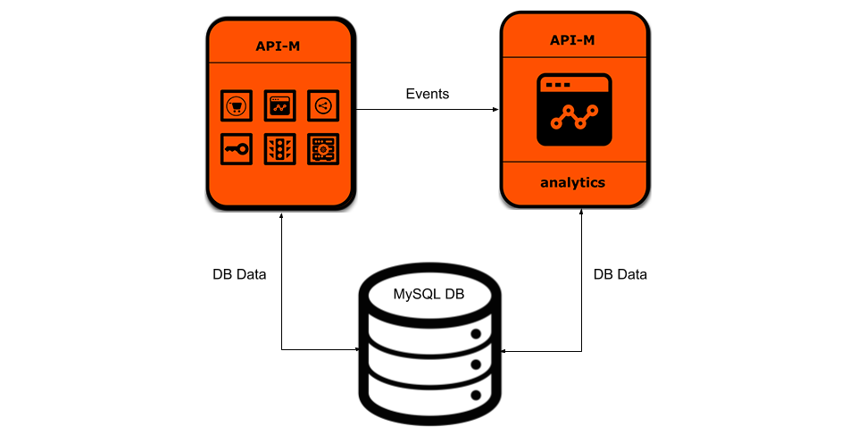

# WSO2 API Manager deployment with WSO2 API Manager Analytics



## Prerequisites

 * [Docker](https://www.docker.com/get-docker) and [Docker Compose](https://docs.docker.com/compose/install/#install-compose) are required for running this Docker Compose template.

## Quick Start Guide

1. Build the WSO2 API manager 2.1.0 and API Manager Analytics 2.1.0 Docker images:
     *  [WSO2 API Manager Dockerfile](../../dockerfiles/apim/README.md)
     *  [WSO2 API Manager Analytics Dockerfile](../../dockerfiles/apim-analytics/README.md)
    > In the `docker-compose.yml`, remove the `dockerhub.wso2.com/` prefix from the `image` name
      
    > For example, change the line `image: dockerhub.wso2.com/wso2am:2.1.0` to `image: wso2am:2.1.0`
2. Pull MySQL Docker image:
     ```
     docker pull mysql:5.7.19
     ```

3. Switch to the docker-compose/apim-analytics folder:
    ```
    cd [docker-apim]/docker-compose/apim-analytics
    ```

4. Execute the following Docker Compose command to start the deployment:
    ```
    docker-compose up
    ```

5. Add the following entrie to the /etc/hosts.
    ```
    127.0.0.1 api-manager
    ```
6. Access the API Publisher and Store via the URLs given below.

    * API Publisher
    ```
    https://api-manager:9443/publisher
    ```

    * API Store
    ```
    https://api-manager:9443/store/
    ```
