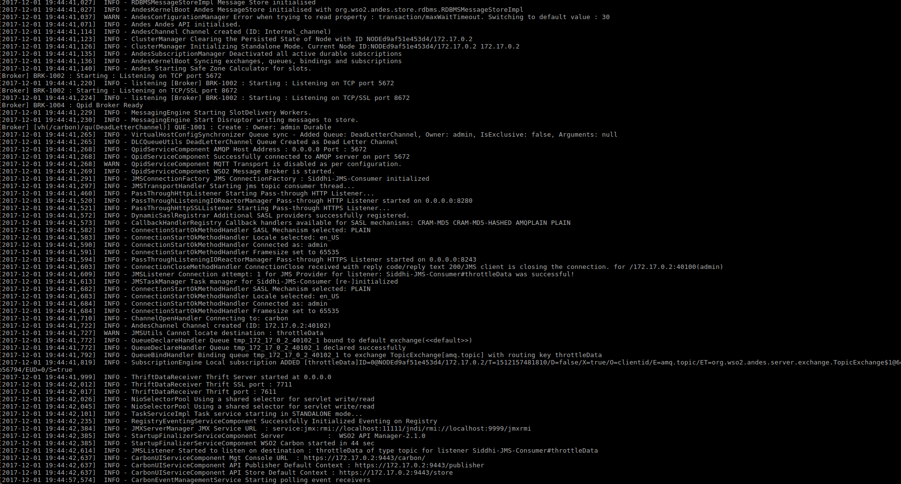

# Dockerfile for WSO2 API Manager #

The Dockerfile defines the resources and instructions to build the Docker image for WSO2 API Manager 2.1.0.

## Quickstart guide

 Steps to build the WSO2 API Manager 2.1.0 Docker image and run in your local machine are as follows:
 
 The local copy of the `Dockerfile` directory will be referred as, `DOCKERFILE_HOME`.
 
 * Create a directory named `files` inside `DOCKERFILE_HOME`
     - This will result in a directory structure `<DOCKERFILE_HOME>/files`.
 
 * Add the JDK and WSO2 API Manager distributions
     - Download JDK 1.8 (http://www.oracle.com/technetwork/java/javase/downloads/jdk8-downloads-2133151.html) and copy it to `<DOCKERFILE_HOME>/files`.
     - Download the WSO2 API Manager 2.1.0 distribution (http://wso2.com/api-management/try-it/) and copy it to `<DOCKERFILE_HOME>/files`.
 
 * Build the Docker image
     - Navigate to `<DOCKERFILE_HOME>` directory.
     - Execute the `docker build` command as shown below;
         + `docker build -t wso2am:2.1.0 .`
 
 * Docker run
     - Run the WSO2 API Manager 2.1.0 Docker container as follows:
         + `docker run -it -p 9443:9443 wso2am:2.1.0`
         
       **Note**: Here, only port 9443 (HTTPS servlet transport) has been mapped to a Docker host port.
       You may map other container service ports, which have been exposed to Docker host ports, as desired.
         
   
 
 * Access management console
     -  To access the management console, use the Docker host IP and port 9443.
         + `https://<DOCKER_HOST_IP>:9443/carbon`
     -  To access the store and publisher, use the Docker host IP, port 9443 and store / publisher contexts.
         + `https://<DOCKER_HOST_IP>:9443/store`
         + `https://<DOCKER_HOST_IP>:9443/publisher`

## Docker command usage references

* [Docker build command reference] (https://docs.docker.com/engine/reference/commandline/build/)

* [Dockerfile reference] (https://docs.docker.com/engine/reference/builder/)

* [Docker run command reference] (https://docs.docker.com/engine/reference/run/)
